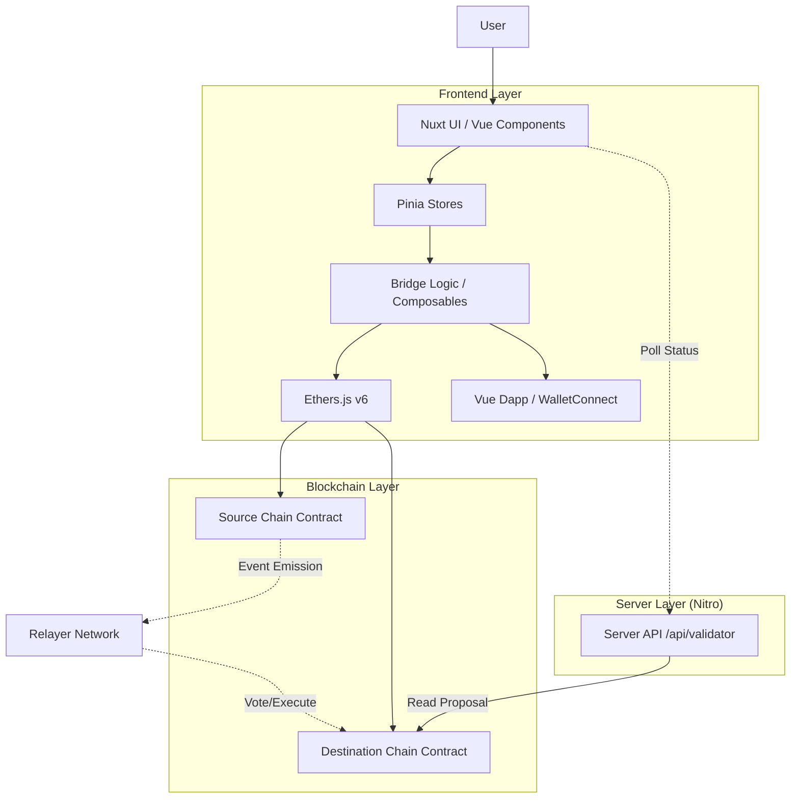
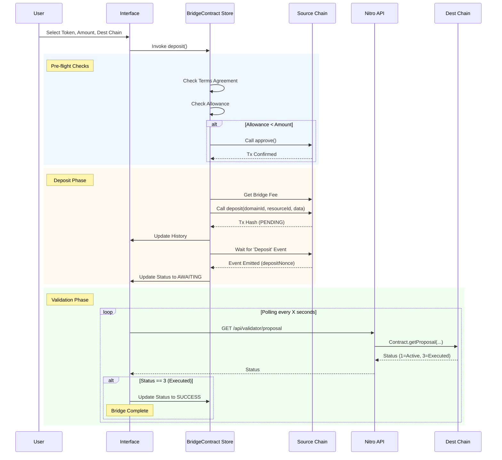

> [!IMPORTANT]
> **Repository Migration Notification**
>
> The development of the W Bridge interface has been merged into the W Swap interface repository.
> Please refer to the new repository for the latest updates and contributions:
> - **Repository**: [https://github.com/w-chain/w-swap-fe](https://github.com/w-chain/w-swap-fe)
> - **Documentation**: [https://github.com/w-chain/w-swap-fe/blob/master/README.md](https://github.com/w-chain/w-swap-fe/blob/master/README.md)

# W Bridge Interface

W Bridge Interface is a cross-chain decentralized application (dApp) built with **Nuxt 3** and **Nuxt UI**. It enables users to transfer ERC-20 tokens between supported networks (W-Chain, BSC, Ethereum) using a secure bridge protocol.

This documentation provides a deep dive into the codebase, architecture, and operational flows for internal developers and maintainers.

## 🏗 Architecture

The application follows a hybrid architecture where the frontend handles direct blockchain interactions for deposits, while a lightweight server-side API acts as a proxy to validate transaction status on destination chains.



## 🛠 Tech Stack

- **Framework**: [Nuxt 3](https://nuxt.com) (Vue 3 + Nitro)
- **UI Library**: [@nuxt/ui](https://ui.nuxt.com) (Tailwind CSS)
- **State Management**: [Pinia](https://pinia.vuejs.org)
- **Blockchain Interaction**: [Ethers.js v6](https://docs.ethers.org/v6/)
- **Wallet Management**: [@vue-dapp/core](https://github.com/vue-dapp/vue-dapp)
- **Icons**: Iconify (Lucide, Simple Icons)

## 🧩 Key Features & Modules

### 1. Token Bridging
Allows users to deposit tokens on a source chain to be minted/released on a destination chain.
- **File**: `stores/BridgeContract.ts`
- **Logic**: Handles fee calculation, allowance checks (`approve`), and the main `deposit` function.

### 2. Transaction History
Persists bridge transactions locally to track their lifecycle across chains.
- **File**: `stores/Transaction.ts`
- **Storage**: `localStorage`
- **States**: `PENDING` → `AWAITING` (Deposit Confirmed) → `SUCCESS` (Executed on Dest).

### 3. Network Management
Automatically handles network switching when the user's wallet is on the wrong chain.
- **File**: `stores/Network.ts`

### 4. Server-Side Validation
A Nitro server route that proxies read-only calls to the destination chain to check if a bridge proposal has been executed.
- **File**: `server/api/validator/proposal.get.ts`

## 🌊 Deep Dive: Bridge Flow

The bridging process involves interaction between the User, the UI/Store, the Smart Contracts, and the Validator API.



### Data Construction
The bridge `deposit` function constructs a specific byte payload (`data`) required by the protocol. This is done in `stores/BridgeContract.ts`:

```typescript
const data = concat([
  // 1. Amount (32 bytes)
  zeroPadValue(toBeHex(parseUnits(amount, decimals)), 32),
  // 2. Recipient Length (32 bytes)
  zeroPadValue(toBeHex(20), 32),
  // 3. Recipient Address (20 bytes)
  zeroPadValue(recipient, 20),
]);
```

## 📂 Project Structure

```
w-bridge/
├── app/
│   ├── components/      # UI components (Bridge forms, History, Modals)
│   ├── composables/     # Shared logic (Wallet, Toasts, Formatters)
│   └── pages/           # Application routes (index.vue, history.vue)
├── server/
│   ├── api/             # Nitro event handlers
│   │   └── validator/   # Proposal status proxy
│   └── service/         # Server-side ethers logic
├── shared/              # Shared Types, ABIs, and Constants
│   ├── abi/             # Contract ABIs (Bridge, ERC20)
│   ├── contracts/       # Contract addresses registry
│   └── types/           # TypeScript interfaces
├── stores/              # Pinia State Management
│   ├── BridgeContract.ts # Core bridging logic
│   ├── BridgeStates.ts   # UI form state
│   └── Transaction.ts    # History persistence
├── nuxt.config.ts       # Nuxt configuration
└── package.json         # Dependencies & Scripts
```

## 🚀 Setup & Development

### Prerequisites
- Node.js (v18+)
- pnpm (v9+)

### Installation

```bash
# Install dependencies
pnpm install
```

### Running Locally

```bash
# Start development server
pnpm run dev
```
The application will be available at `http://localhost:3000`.

### Building for Production

```bash
# Build the application
pnpm run build

# Preview production build
pnpm run preview
```
